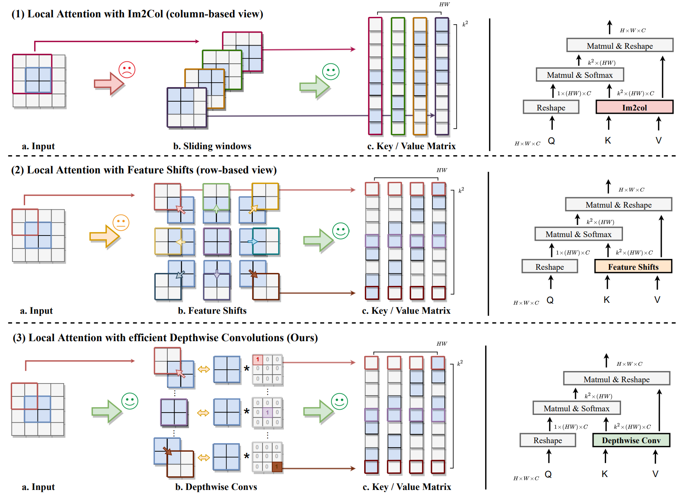

This repo contains the official PyTorch code for **Slide-Transformer**.

+ [Slide-Transformer: Hierarchical Vision Transformer with Local Self-Attention](https://arxiv.org/abs/2304.04237)

## Introduction

<p align="center">
    
</p>


- Self-attention mechanism has been a key factor in the recent progress of Vision Transformer (ViT), which enables adaptive feature extraction from global contexts. However, existing self-attention methods either adopt sparse global attention or window attention to reduce the computation complexity, which may compromise the local feature learning or subject to some handcrafted designs. 

- In contrast, local attention, which restricts the receptive field of each query to its own neighboring pixels, enjoys the benefits of both convolution and self-attention, namely local inductive bias and dynamic feature selection. Nevertheless, current local attention modules either use inefficient Im2Col function or rely on specific CUDA kernels that are hard to generalize to devices without CUDA support.

- In this paper, we propose a novel local attention module, Slide Attention, which leverages common convolution operations to achieve high efficiency, flexibility and generalizability. Specifically, we first re-interpret the column-based Im2Col function from a new row-based perspective and use Depthwise Convolution as an efficient substitution. On this basis, we propose a deformed shifting module based on the re-parameterization technique, which further relaxes the fixed key/value positions to deformed features in the local region. In this way, our module realizes the local attention paradigm in both efficient and flexible manner. Extensive experiments show that our slide attention module is applicable to a variety of advanced Vision Transformer models and compatible with various hardware devices, and achieves consistently improved performances on comprehensive benchmarks.


## Method

<p align="center">
    
</p>

- Sub-figure(1): Im2Col function is viewed in a column-based way, where each column of the key/value matrix corresponds to the local region of a particular query (1.b). The process of sampling windows breaks data locality and leads to inefficiency ✗. 

- Sub-figure(2): we view the key/value matrix in a row-based way, where each row is equivalent to the input feature, only after shifting towards certain directions (2.b). Nevertheless, shifting toward different directions is also inefficient when compared with common operators ✗. 

- Sub-figure(3): we take a step forward, and substitute shifting operations with carefully designed depthwise convolutions, which is not only efficient but also friendly to different hardware implementations ✓.

<p align="center">
    
</p>

- At the training stage, we maintain two paths, one with designed kernel weights to perform shifting towards different directions, and the other with learnable parameters to enable more flexibility.

- At the inference stage, we merge these two convolution operations into a single path with re-parameterization, which improves the model capacity while maintaining the inference efficiency.

## Results

### Classification

- Comparison of different models on ImageNet-1K.

<p align="center">
    
</p>

- Comparison of different models on COCO.

<p align="center">
    
</p>

- Comparison of different models on ADE20K.

<p align="center">
    
</p>

- Runtime comparison on Metal Performance Shader and iPhone 12 devices.

<p align="center">
    
</p>


## Acknowledgements

Our code is developed on the top of [PVT](https://github.com/whai362/PVT), [Swin Transformer](https://github.com/microsoft/Swin-Transformer), [CSwin Transformer](https://github.com/microsoft/CSWin-Transformer).

## Citation

If you find this repo helpful, please consider citing us.

```latex
@inproceedings{pan2023slide,
  title={Slide-transformer: Hierarchical vision transformer with local self-attention},
  author={Pan, Xuran and Ye, Tianzhu and Xia, Zhuofan and Song, Shiji and Huang, Gao},
  booktitle={Proceedings of the IEEE/CVF conference on computer vision and pattern recognition},
  pages={2082--2091},
  year={2023}
}
```